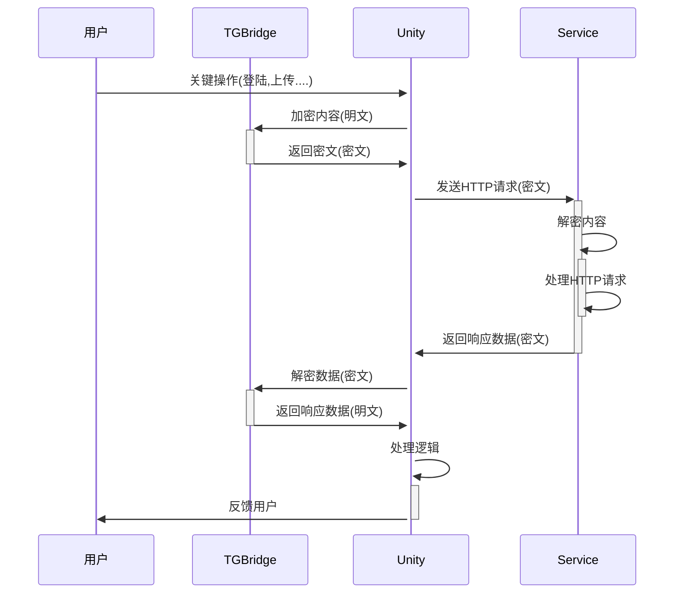

# 安全通讯

```mermaid
sequenceDiagram
    participant A as 用户
    participant C as TGBridge
    participant B as Unity
    participant D as Service

    A->>+B: 关键操作(登陆,上传....)
    B->>+C: 加密内容(明文)
    C->>-B: 返回密文(密文)
    B->>+D: 发送HTTP请求(密文)
    D->>+D: 解密内容
    D->>-D: 处理HTTP请求
    D->>-B: 返回响应数据(密文)
    B->>+C: 解密数据(密文)
    C->>-B: 返回响应数据(明文)
    B->>+B: 处理逻辑
    B->>-A: 反馈用户
```
