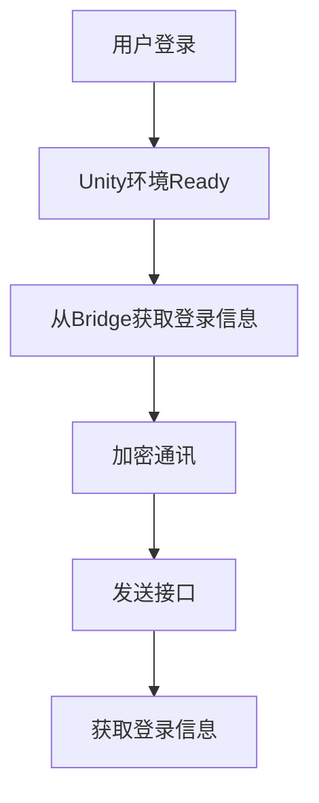
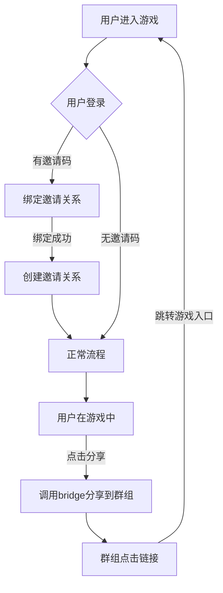

# Telegram mini app

## TG Bridge

Unity/TG/Service端的桥接的需求整理,基础逻辑的开发

[link to TG Bridge](/tg_bridge/intro.html)

## 登陆功能

## 分享功能

## 适配Unity

适配用户在TG中出现的Unity的**兼容问题**,比如不能运行,适配失败等问题.

因为我们自己的**测试/机型**有限,所以依赖**用户反馈**才能进行适配.

优先在**第一个版本**中尽量保证兼容性,然后等待测试期间反馈

## 安全通讯

TODO待补充 需要TG、Unity、Service端三方搭配,利用密码学实现通讯的加解密